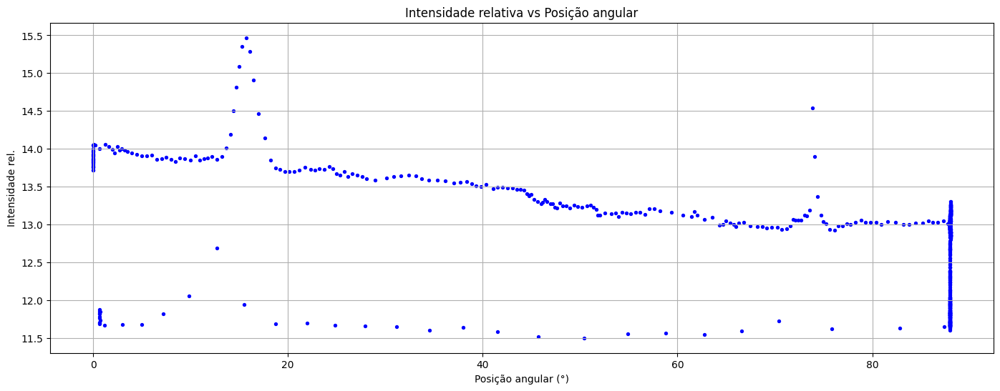
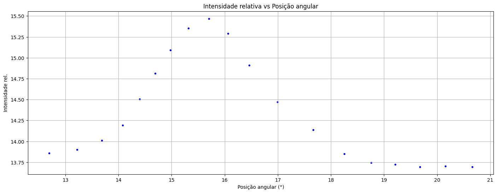
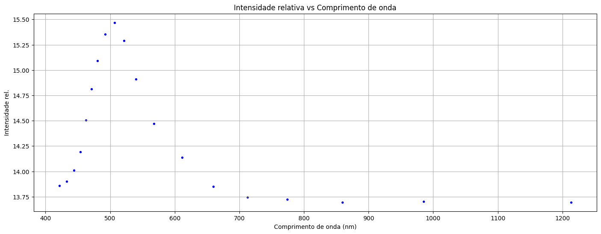
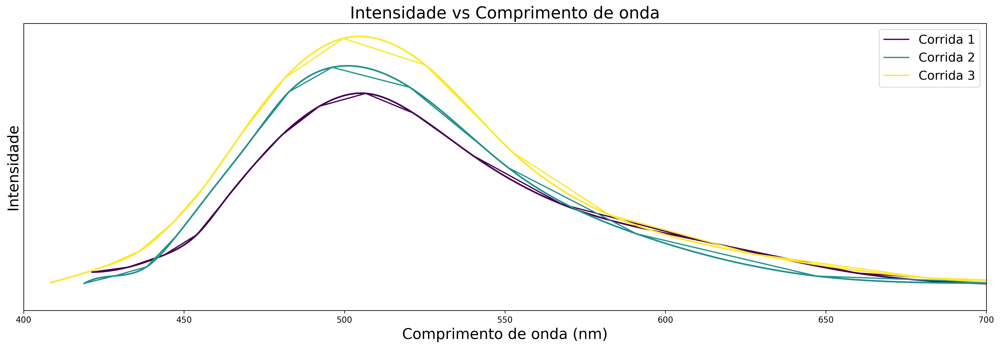

# Blackbody Radiation Spectrum via a Prism Spectrometer

Data analysis pipeline for an undergraduate physics lab experiment in which the
relative light intensity emitted by a thermal (blackbody-like) source is
measured as a function of angular position on a prism spectrometer, converted
into a wavelength spectrum, and compared — qualitatively — against the shape
predicted by **Planck's law** of blackbody radiation.

This repository contains the raw-to-processed data pipeline, the plotting
utilities used throughout, and the Jupyter notebook that runs the full
analysis end-to-end for several experimental runs ("*corridas*").

> Written up so the next student running this experiment doesn't have to
> reverse-engineer the pipeline from scratch.

## Table of Contents

- [Overview](#overview)
- [Theory](#theory)
  - [1. Prism spectrometer & dispersion](#1-prism-spectrometer--dispersion)
  - [2. Blackbody radiation & Planck's law](#2-blackbody-radiation--plancks-law)
- [Repository Structure](#repository-structure)
- [Data Format](#data-format)
- [Analysis Pipeline](#analysis-pipeline)
- [Installation](#installation)
- [Usage](#usage)
- [Example Results](#example-results)
- [Notes & Suggestions for Future Students](#notes--suggestions-for-future-students)
- [Keywords](#keywords)
- [Author](#author)
- [License](#license)

## Overview

A prism spectrometer disperses light by wavelength: because the refractive
index of the prism depends on wavelength, each wavelength emerges at a
slightly different angle. By slowly scanning the telescope/detector across a
range of angular positions and recording the relative light intensity at each
position, a raw **intensity vs. angle** scan is obtained. Using a
pre-calibrated relation between angular position and wavelength, that scan is
converted into an **intensity vs. wavelength** spectrum, which can then be
compared with the spectral shape predicted by Planck's law for a thermal
source.

The pipeline implemented here:

1. reads and cleans the raw scan files (`experimental_data/corridaN.txt`);
2. isolates the angular window containing the spectral peak of interest;
3. converts angular position into wavelength using the prism's calibrated
   dispersion relation;
4. corrects the intensity baseline;
5. compares the resulting spectra — both directly and on a log scale — across
   multiple runs, and against the qualitative shape expected from Planck's
   law.

## Theory

### 1. Prism spectrometer & dispersion

The refractive index `n` of the prism material is not constant — it depends
on wavelength (dispersion). A common empirical two-term **Cauchy
relation** is used here to describe that dependence:

$$n(\lambda) = B + \frac{A}{\lambda^2}$$

with `λ` in nanometers, `A` in nm², and `B` dimensionless. `A` and `B` are
calibration constants specific to the prism/apparatus used, normally obtained
beforehand by fitting this relation to reference wavelengths of known value
(e.g. the emission lines of a calibration lamp). In this repository they
default to `A = 13900 nm²` and `B = 1.689` (see `theta_para_lambda` in
[`manipulation.py`](manipulation.py)) — **recalibrate these if you use a
different prism or apparatus.**

Because the exit angle of a given wavelength depends on the prism's
refractive index at that wavelength (and the fixed geometry of the
apparatus — apex angle, angle of incidence, etc.), each angular reading
`θ` can first be converted into a refractive index:

$$n(\theta) = \sqrt{\left(\frac{2}{\sqrt{3}}\sin(\theta_0 - \theta) + \frac{1}{2}\right)^2 + \frac{3}{4}}$$

where `θ₀ ≈ 1.3439 rad` is a fixed reference angle baked into this
apparatus's geometry, and then inverted through the Cauchy relation to get
the wavelength:

$$\lambda(\theta) = \sqrt{\frac{A}{n(\theta) - B}}$$

This two-step angle → index → wavelength conversion is exactly what
`theta_para_lambda` and `transformacao_de_eixo` implement.

### 2. Blackbody radiation & Planck's law

Planck's law gives the spectral radiance of an ideal blackbody at
temperature `T` as a function of wavelength:

$$B(\lambda, T) = \frac{2hc^2}{\lambda^5}\,\frac{1}{e^{hc/(\lambda k_B T)} - 1}$$

For a real, non-ideal thermal source (e.g. an incandescent lamp filament),
the measured spectral intensity is expected to follow the same qualitative
shape: it rises from short wavelengths, peaks at a wavelength set by the
source's temperature (**Wien's displacement law**, `λ_max T = b` with
`b ≈ 2.898 × 10⁻³ m·K`), and then decays roughly exponentially at longer
wavelengths (the **Wien approximation**, valid when `hc/(λk_BT) ≫ 1`):

$$B(\lambda, T) \approx \frac{2hc^2}{\lambda^5}\, e^{-hc/(\lambda k_B T)}$$

Taking the logarithm of this approximation gives a smooth, slowly-varying
function of `λ` — which is exactly what `lei_de_plank()` plots
(`ln(intensity)` vs. wavelength) to let you visually judge whether the
measured decay is consistent with the blackbody prediction, without needing
to perform a full non-linear fit.

> **Note:** the current notebook performs this comparison qualitatively
> (by eye, on a log plot) rather than fitting Planck's law directly to the
> data — see [Notes & Suggestions](#notes--suggestions-for-future-students)
> below for a natural next step.

## Repository Structure

```
.
├── data_analysis.ipynb      # Main notebook: runs the full pipeline per run
├── manipulation.py          # Read/clean/filter/transform functions
├── visualization.py         # Plotting functions
├── requirements.txt         # Python dependencies
├── experimental_data/       # Raw run files (corrida7.txt, corrida8.txt, ...)
└── figs/                    # Saved output figures (e.g. lei_de_plank_1.png)
```

`experimental_data/` isn't included in this repository snapshot — add your
own run files there, following the format described below.

## Data Format

Each run ("*corrida*") is a **tab-separated** `.txt` file with (at least)
two columns:

| Column                     | Meaning                                  |
|-----------------------------|-------------------------------------------|
| `Posição_Angular(graus)`    | Angular position of the detector, in degrees |
| `Intensidade_rel_(%)`       | Relative light intensity, in percent      |

Numbers are exported with a **comma** as the decimal separator (e.g.
`14,05`), matching the acquisition software's regional settings — the
cleaning step converts these to standard dot-decimal floats.

## Analysis Pipeline

For each run, `data_analysis.ipynb` walks through:

1. **Read** — load the raw tab-separated file (`pandas.read_csv`).
2. **Clean** — convert comma-decimal strings to numeric floats.
3. **Visualize** — quick scatter plot of intensity vs. angular position
   over the full scan.
4. **Choose the useful domain** — restrict to the angular window
   containing the spectral peak of interest, discarding background/noise
   from the rest of the sweep (`dominio`).
5. **Transform the axis** — convert angular position into wavelength
   using the prism's dispersion relation (`transformacao_de_eixo`).
6. **Baseline-correct** — shift the intensity so its minimum sits at zero.
7. **Compare across runs** — overlay multiple runs' spectra, optionally
   with baseline removal, normalization, and cubic-spline smoothing
   (`lei_de_plank_varias`), and inspect the log-intensity decay against
   the qualitative Planck's-law prediction (`lei_de_plank`).

`filtrar_transformar` and `ler_limpar_visualizar` bundle several of these
steps together for more concise, later-run analyses.

## Installation

Requires **Python 3.10+** (developed with 3.12).

```bash
git clone <this-repository-url>
cd <repository-folder>
pip install -r requirements.txt
```

Dependencies: `pandas`, `numpy`, `matplotlib`, `scipy` (for `CubicSpline`),
and `jupyter` to run the notebook.

## Usage

```python
from manipulation import ler_limpar_visualizar, filtrar_transformar
from visualization import lei_de_plank, lei_de_plank_varias

# 1-2-3: read, clean, and preview a run in one call
corrida = ler_limpar_visualizar("experimental_data/corrida7.txt")

# 4-5: keep only the angular window with the spectral peak, and convert
# it to wavelength
corrida_transformada = filtrar_transformar(
    corrida, angulo_min=12, angulo_max=21, intensidade_min=16
)

# 6: baseline-correct (shift the intensity minimum to zero)
corrida_final = corrida_transformada.copy()
corrida_final["Intensidade_rel_(%)"] -= corrida_transformada["Intensidade_rel_(%)"].min()

# Compare the log-intensity decay against the qualitative Planck's-law shape
lei_de_plank(corrida_final, spline=True, lim_superior=700)

# Compare several runs on the same axes
lei_de_plank_varias(
    [corrida_final],
    spline=True,
    normalizar=True,
    save_fig=True,
    nome_fig="my_run_comparison.png",
)
```

Run the full worked example (all runs) from `data_analysis.ipynb` in Jupyter:

```bash
jupyter notebook data_analysis.ipynb
```

## Example Results

**Raw angular scan** — intensity vs. angular position over the full sweep,
before selecting the useful domain:



**After selecting the useful domain** — the same run restricted to the
angular window containing the spectral peak (`dominio`):



**After the angle-to-wavelength transformation** — the same data plotted
against wavelength instead of angular position (`transformacao_de_eixo`):



**Comparison across multiple runs** — baseline-corrected, spline-smoothed
spectra for three separate runs, generated with
`lei_de_plank_varias(..., save_fig=True, nome_fig="lei_de_plank_1.png")`:



## Notes & Suggestions for Future Students

A few things worth knowing before you extend this pipeline:

- **No quantitative fit yet.** The comparison to Planck's law is currently
  qualitative (a log-intensity plot inspected by eye). A natural next step
  is fitting Planck's law directly with `scipy.optimize.curve_fit` to
  extract the source's temperature, and reporting the fit uncertainty.
- **Recalibrate for your apparatus.** The constants in `theta_para_lambda`
  (`A`, `B`, and the `1.3439` rad reference angle) are specific to the
  prism/apparatus used here — re-derive them if you use a different setup.
- **Check which intensity version you're plotting.** In the original
  analysis, the baseline-corrected version (`*_final`) is compared for some
  runs but the pre-correction version (`*_transformada`) for others — make
  sure you know which one you intend before comparing runs.
- **Inspect each run's raw file before trusting it.** At least one run
  needed trailing rows manually dropped (corrupted/garbage readings at the
  end of the file) before cleaning — don't assume every `.txt` file is
  well-formed.

## Keywords

`blackbody radiation` · `Planck's law` · `prism spectrometer` ·
`dispersion relation` · `Cauchy equation` · `refractive index` ·
`spectroscopy` · `Wien's displacement law` · `experimental physics` ·
`data analysis` · `Python` · `pandas` · `matplotlib` · `scipy`

## Author

**Denis Domeniconi Caprioti**
Physics Undergraduate, Universidade Federal de Santa Catarina (UFSC)

### Co-author:

**Lorenzo Heald**
Physics Undergraduate, Universidade Federal de Santa Catarina (UFSC);
lorenzo.heald@grad.ufsc.br
